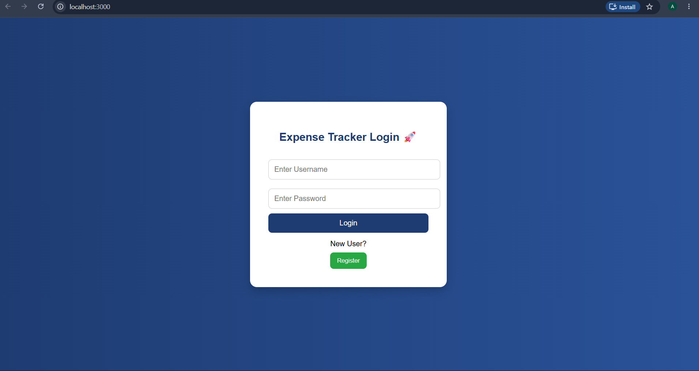
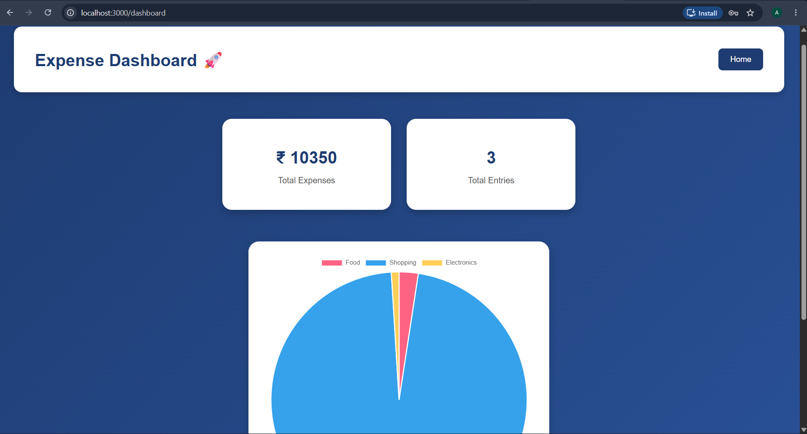
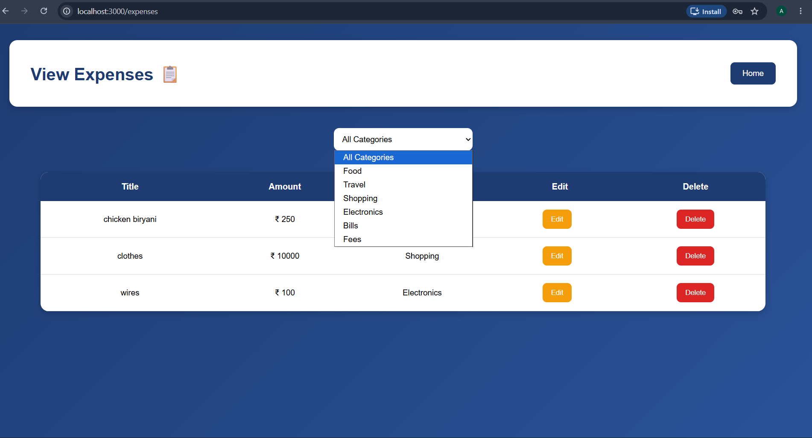
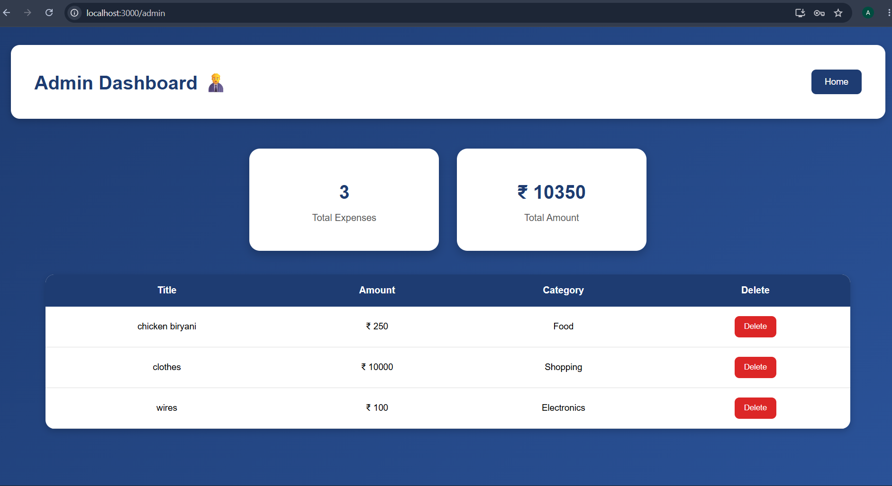
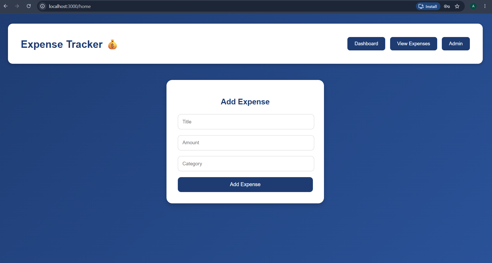

# Expense Tracker 💰

A full-stack Expense Tracker web application built using React, Spring Boot, and MySQL.

This application helps users manage their daily expenses with features like expense tracking, analytics dashboard, category filtering, authentication, and monthly reports.

---

## 🚀 Features

### 🔐 Authentication
- User Registration
- User Login
- Secure API access using Spring Security

### 💸 Expense Management
- Add Expenses
- Update Expenses
- Delete Expenses
- View All Expenses

### 📊 Dashboard Analytics
- Total Expenses
- Monthly Expense Report
- Total Expense Entries
- Pie Chart Analytics using Chart.js

### 🔍 Filtering
- Filter expenses by category
- Categories like Food, Travel, Shopping, etc.

### 🎨 UI Features
- Professional dashboard layout
- Responsive design
- Separate Dashboard & Expense views
- Clean and modern styling

---

## 🛠️ Tech Stack

### Frontend
- React.js
- Axios
- Chart.js
- React ChartJS 2
- CSS

### Backend
- Spring Boot
- Spring Security
- REST APIs
- Postman

### Database
- MySQL workbench

---

## 📂 Project Structure

```bash
ExpenseTracker/
│
├── frontend/
│   ├── src/
│   ├── components/
│   └── Dashboard.js
│
├── backend/
│   ├── controller/
│   ├── service/
│   ├── repository/
│   └── model/
```

---

## ⚙️ Installation & Setup

### 1️⃣ Clone Repository

```bash
git clone https://github.com/AmruthavarshiniAvvari/expense-tracker.git
```

---

### 2️⃣ Backend Setup

Open backend project in IntelliJ or Eclipse.

Configure MySQL database in:

```properties
application.properties
```

Run Spring Boot application.

Backend runs on:

```bash
http://localhost:8080
```

---

### 3️⃣ Frontend Setup

Open frontend folder in VS Code.

Install dependencies:

```bash
npm install
```

Run frontend:

```bash
npm start
```

Frontend runs on:

```bash
http://localhost:3000
```

---

# Expense Tracker App 💰

## Login Page



---

## Dashboard



---

## Expense Table



---

## Admindashboard



---

## Homepage



---


## 👩‍💻 Author

**Amrutha varshini Avvari**

- Java Full Stack Developer
- React & Spring Boot Enthusiast

---

## ⭐ Project Status

✅ Completed and functional
